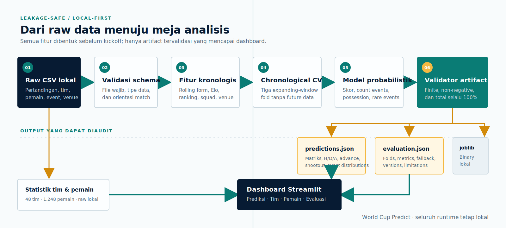

<div align="center">

# World Cup Predict

### Meja analisis probabilistik untuk semifinal Piala Dunia 2026

Pipeline modeling leakage-safe dan dashboard lokal berbahasa Indonesia untuk membaca probabilitas skor 90 menit, hasil pertandingan, peluang lolos, potensi adu penalti, distribusi event, serta statistik 48 tim dan 1.248 pemain.

<p>
  
  
  
  
</p>

<p>
  
  
  
  
  
  
  
</p>

[Fitur](#fitur-utama) · [Hasil model](#snapshot-prediksi) · [Tech stack](#tech-stack) · [Instalasi](#instalasi) · [Training](#training-model) · [Dashboard](#menjalankan-dashboard) · [Evaluasi](#evaluasi-model)

</div>

---

## Tentang proyek

World Cup Predict menyatukan tiga kebutuhan dalam satu repository:

1. Rekonstruksi fitur pertandingan secara kronologis tanpa melihat informasi masa depan.
2. Training dan evaluasi model probabilistik melalui notebook atau CLI yang memakai pipeline identik.
3. Dashboard Streamlit lokal untuk menyajikan hasil model dan statistik turnamen dalam format meja analisis siaran.

Fokus prediksi versi pertama adalah dua semifinal berikut, dengan urutan home/away yang mengikuti dataset:

| Match ID | Home | Away | Kickoff UTC |
|---:|---|---|---|
| 101 | France | Spain | 14 Juli 2026, 20:00 |
| 102 | England | Argentina | 15 Juli 2026, 20:00 |

Prediksi selalu mengacu pada 90 menit waktu normal. Extra time dan shootout dihitung sebagai tahap lanjutan yang terpisah.

## Snapshot prediksi

Artifact repository dibuat dengan data cutoff **12 Juli 2026** dan random seed tetap `20260713`.

### Probabilitas hasil dan lolos

| Pertandingan | Home win | Seri | Away win | Home lolos | Away lolos | Masuk shootout |
|---|---:|---:|---:|---:|---:|---:|
| France vs Spain | 25,85% | 25,81% | 48,34% | 37,27% | 62,73% | 12,30% |
| England vs Argentina | 31,27% | 26,65% | 42,08% | 43,87% | 56,13% | 12,82% |

### Skor paling mungkin

| Pertandingan | Skor pertama | Skor kedua | Skor ketiga |
|---|---:|---:|---:|
| France vs Spain | 1–1 · 12,22% | 1–2 · 9,54% | 0–1 · 8,93% |
| England vs Argentina | 1–1 · 12,60% | 1–2 · 9,00% | 0–1 · 8,27% |

> Angka di atas adalah estimasi probabilistik, bukan kepastian hasil. Snapshot dapat berubah apabila raw data, konfigurasi, atau cutoff training berubah.

## Fitur utama

### Prediksi pertandingan

- Matriks probabilitas skor `0–6` dengan satu bin tail `7+`.
- Lima exact score paling mungkin.
- Probabilitas home win, draw, dan away win untuk 90 menit.
- Peluang setiap tim lolos ke final.
- Peluang pertandingan mencapai adu penalti.
- Expected goals untuk kedua tim.
- Distribusi, expected count, dan interval 80% untuk:
  - shots;
  - shots on target;
  - corners;
  - fouls;
  - offsides;
  - yellow cards;
  - red cards;
  - saves;
  - possession;
  - VAR reviews.

### Statistik tim

- Ringkasan seluruh 48 peserta.
- Form menang/seri/kalah dan lima laga terakhir.
- Goals, xG, shots, shots on target, dan possession.
- Corners, fouls, offsides, saves, kartu kuning, dan kartu merah.
- Ranking FIFA, Elo, caps skuad, usia rata-rata, serta nilai skuad.
- Perbandingan sampai empat tim sekaligus, dengan empat semifinalis sebagai pilihan awal.

### Direktori pemain

- Pencarian 1.248 pemain berdasarkan nama atau klub.
- Filter tim dan posisi.
- Usia, klub, caps, market value, menit, dan jumlah starter.
- Gol, assist, shots, kartu kuning, dan kartu merah.
- Clean sheets, saves, dan goals conceded untuk goalkeeper.
- Tidak ada prediksi individual pemain pada versi pertama.

### Evaluasi dan transparansi

- Data cutoff dan jumlah sampel training.
- Hasil setiap chronological fold.
- Perbandingan model kandidat dengan baseline.
- Exact-score log loss dan outcome log loss.
- Status fallback untuk setiap target event.
- Penjelasan kalibrasi, confidence, dan keterbatasan model.

## Arsitektur pipeline

<p align="center">
  
</p>

Diagram menggunakan SVG lokal sehingga tetap tampil tanpa renderer Mermaid atau JavaScript tambahan.

### Perlindungan terhadap leakage

Pipeline menjaga beberapa batas penting:

- Setiap fold hanya menggunakan pertandingan yang kickoff sebelum validation fold.
- Rolling form diperbarui setelah pertandingan selesai, bukan sebelum fitur pre-match dibuat.
- Hanya 92 laga berlabel `Regular` yang menjadi target skor 90 menit.
- Empat laga AET dan empat laga penalti tidak dianggap memiliki label skor 90 menit.
- Statistik laga AET/penalti hanya dipakai untuk rolling form setelah dinormalisasi menjadi ekuivalen 90 menit.
- Kolom target dan identitas berikut dilarang masuk matriks model:
  - `home_score` dan `away_score`;
  - `result_type` dan `match_result`;
  - current-match `home_xg` dan `away_xg`;
  - nama tim, ID tim, match ID, venue ID, referee ID, dan stage ID.
- Artifact ditolak jika mengandung NaN, probabilitas negatif, total probabilitas yang tidak 100%, atau orientasi semifinal yang berubah.

## Model probabilistik

### Skor 90 menit

Model membandingkan empat kandidat melalui tiga expanding-window folds:

| Kandidat | Exact-score log loss | Outcome log loss |
|---|---:|---:|
| Smoothed baseline | 3,2134 | 1,0680 |
| Regularized Poisson | 2,9235 | **0,7697** |
| **Poisson–Dixon–Coles blend** | **2,9214** | 0,7751 |
| Dixon–Coles | 2,9237 | 0,7819 |

Pipeline memilih **Poisson–Dixon–Coles blend** karena exact-score log loss menjadi metrik utama dan membaik sekitar **9,1%** terhadap baseline. Outcome log loss tetap ditampilkan agar trade-off pemilihan model terlihat jelas.

### Model event

| Target | Model terpilih | Catatan |
|---|---|---|
| Shots | Regularized Negative Binomial | Mengakomodasi overdispersion count |
| Shots on target | Regularized Poisson | Mengungguli baseline likelihood |
| Corners | Regularized Poisson | Mengungguli baseline likelihood |
| Fouls | Smoothed baseline | Regresi count tidak mengungguli baseline |
| Offsides | Regularized Poisson | Mengungguli baseline likelihood |
| Yellow cards | Regularized Poisson | Mengungguli baseline likelihood |
| Saves | Regularized Poisson | Mengungguli baseline likelihood |
| Possession | Constrained ridge | Prediksi kedua tim dinormalisasi menjadi 100% |
| Red cards | Beta-smoothed rate | Confidence rendah; hanya 13 kejadian |
| VAR reviews | Beta-smoothed rate | Confidence rendah; hanya 13 kejadian |

Peluang shootout dihitung dari peluang seri 90 menit dan simulasi extra time 30 menit. Jika extra time tetap seri, peluang menang shootout dibagi `50/50` karena sampel tidak cukup untuk menilai kemampuan penalti setiap tim.

## Tech stack

| Lapisan | Teknologi | Peran |
|---|---|---|
| Runtime |  | Runtime utama pipeline, training, tests, dan dashboard |
| Data processing |  | Join, agregasi, chronological features, dan artifact tables |
| Numerical computing |  | Matriks probabilitas, normalisasi, dan operasi numerik |
| Machine learning |  | Poisson regression, ridge regression, scaling, dan pipeline |
| Statistical modeling |  | Dependensi analisis statistik dan perluasan eksperimen count |
| Scientific distributions |  | Poisson/NB PMF, optimasi Dixon–Coles, dan interval |
| Experiment driver |  | EDA, training, evaluasi, dan pembuatan artifact |
| Dashboard |  | Navigasi dan penyajian dashboard lokal |
| Visualization |  | Heatmap skor dan chart distribusi interaktif |
| Serialization |  | Penyimpanan model binary lokal |
| Testing |  | Unit, integration, artifact contract, CLI, dan dashboard smoke tests |
| Typography |  | Font dashboard yang dibundel agar antarmuka tetap offline |

## Struktur repository

```text
world-cup-predict/
├── app.py                         # Entry point dashboard Streamlit
├── artifacts/
│   ├── evaluation.json           # Metrik, folds, fallback, dan limitation
│   ├── metrics_summary.csv       # Ringkasan metrik agregat
│   ├── predictions.json          # Prediksi dua semifinal
│   └── models/                   # Binary lokal, diabaikan Git
├── assets/fonts/                 # Ubuntu Sans/Mono dan lisensinya
├── data/                          # Raw CSV lokal, diabaikan Git
├── notebooks/
│   └── 01_training.ipynb         # Notebook training yang sudah dieksekusi
├── scripts/
│   └── train.py                  # CLI training reproducible
├── src/
│   ├── config.py                 # Konstanta, seed, dan feature guard
│   ├── data.py                   # Rekonstruksi fitur kronologis
│   ├── modeling.py               # Model skor, count, dan possession
│   ├── probability.py            # Matriks skor dan distribusi event
│   ├── training.py               # Orkestrasi artifact dan validasi
│   └── dashboard/
│       ├── charts.py             # Plotly figures
│       ├── data_access.py        # Loader dan agregasi statistik
│       ├── pages.py              # Empat halaman dashboard
│       └── styles.py             # Tema broadcast dan font offline
├── tests/                         # 13 contract, modeling, dan smoke tests
├── pyproject.toml
└── requirements.txt
```

## Instalasi

### Prasyarat

- Python `3.13.4`.
- Git untuk mengambil repository.
- Raw CSV lokal bila ingin training ulang atau membuka halaman Tim dan Pemain.
- Tidak diperlukan database, Docker, API key, atau deployment cloud.

### Linux, macOS, atau WSL

```bash
git clone https://github.com/iltizamhasan3/world-cup-predict.git
cd world-cup-predict

python3.13 -m venv .venv
.venv/bin/python -m pip install --upgrade pip
.venv/bin/python -m pip install -r requirements.txt
```

### Windows PowerShell

```powershell
git clone https://github.com/iltizamhasan3/world-cup-predict.git
cd world-cup-predict

py -3.13 -m venv .venv
.venv\Scripts\python -m pip install --upgrade pip
.venv\Scripts\python -m pip install -r requirements.txt
```

## Menyiapkan raw data

Raw CSV tidak dipublikasikan karena lisensi redistribusinya belum terverifikasi. Letakkan file sumber di folder `data/`:

```text
data/
├── match_events.csv
├── match_lineups.csv
├── match_prediction_features.csv
├── match_team_stats.csv
├── matches.csv
├── matches_detailed.csv
├── player_stats.csv
├── referees.csv
├── squads_and_players.csv
├── teams.csv
├── tournament_stages.csv
└── venues.csv
```

Pipeline training inti memvalidasi keberadaan tabel pertandingan, tim, stage, venue, referee, skuad, match statistics, events, dan player statistics. File fitur jadi tidak digunakan sebagai jalan pintas untuk training karena memuat kolom target current-match.

## Training model

### Melalui notebook

Notebook adalah pengendali utama EDA, training, evaluasi, dan pembuatan artifact.

```bash
.venv/bin/jupyter lab notebooks/01_training.ipynb
```

Untuk menjalankan seluruh notebook secara non-interaktif:

```bash
.venv/bin/jupyter nbconvert \
  --to notebook \
  --execute \
  --inplace notebooks/01_training.ipynb \
  --ExecutePreprocessor.timeout=300
```

### Melalui CLI

CLI memanggil pipeline yang sama dengan notebook:

```bash
.venv/bin/python scripts/train.py
```

Output yang diharapkan:

```text
Selesai: 2 semifinal, model skor poisson_dc_blend.
```

## Kontrak artifact

### `artifacts/predictions.json`

Berisi metadata model dan dua objek pertandingan dengan:

- identitas pertandingan, venue, dan kickoff;
- matriks probabilitas skor;
- lima exact score teratas;
- probabilitas H/D/A 90 menit;
- peluang lolos setiap tim;
- peluang shootout;
- distribusi home, away, dan total untuk setiap event;
- expected count, interval 80%, family model, confidence, dan warning.

### `artifacts/evaluation.json`

Berisi:

- data cutoff dan random seed;
- jumlah sampel dan laga yang dikeluarkan;
- metrik setiap chronological fold;
- metrik agregat semua kandidat;
- model terpilih dan fallback reason;
- evaluasi model event dan possession;
- versi library;
- keterbatasan model.

### Model binary

Binary pipeline ditulis ke:

```text
artifacts/models/probabilistic_pipeline.joblib
```

Folder tersebut sengaja diabaikan Git. Dashboard membaca JSON publik dan tidak membutuhkan binary model untuk menampilkan prediksi yang sudah dibuat.

## Menjalankan dashboard

### Linux, macOS, atau WSL

```bash
.venv/bin/streamlit run app.py
```

### Windows PowerShell

```powershell
.venv\Scripts\streamlit run app.py
```

Buka `http://localhost:8501` apabila browser tidak terbuka otomatis.

| Halaman | Artifact JSON | Raw CSV lokal |
|---|:---:|:---:|
| Prediksi | Wajib | Tidak wajib |
| Tim | Tidak wajib | Wajib |
| Pemain | Tidak wajib | Wajib |
| Evaluasi | Wajib | Tidak wajib |

Dashboard memakai layout responsive, visible keyboard focus, reduced-motion support, serta font yang dibundel. Tidak ada font, stylesheet, atau komponen runtime yang harus diambil dari CDN.

## Menjalankan tests

```bash
.venv/bin/python -m pytest
```

Suite saat ini mencakup 13 tests untuk:

- feature contract dan forbidden columns;
- chronological fold ordering;
- perlindungan terhadap future observation leakage;
- normalisasi score matrix dan event distribution;
- peluang advance dan shootout;
- score model training smoke test;
- artifact schema, orientasi, dan probability drift;
- agregasi tepat 48 tim dan 1.248 pemain;
- navigasi seluruh halaman Streamlit;
- CLI training dari root repository.

Pemeriksaan tambahan yang berguna:

```bash
.venv/bin/python -m compileall -q app.py src scripts tests
git diff --check
```

## Evaluasi model

Model kandidat hanya dipakai ketika mengungguli baseline pada validation metric terkait. Jika tidak, pipeline otomatis memakai fallback tersmoothing dan menyimpan alasannya di `evaluation.json`.

Validasi akhir memastikan:

- score matrix berjumlah 100%;
- H/D/A berjumlah 100%;
- peluang lolos kedua tim berjumlah 100%;
- setiap event distribution berjumlah 100%;
- possession kedua tim berjumlah 100%;
- tidak ada probabilitas negatif, NaN, atau infinity;
- France–Spain tetap match 101 dan England–Argentina tetap match 102.

## Desain dashboard

Arah visual memakai konsep **meja analisis siaran**:

- broadcast navy `#071B33` sebagai warna struktur;
- pitch teal `#0A7C75` untuk kubu home dan probabilitas utama;
- signal amber `#F4B942` untuk kubu away serta sinyal penting;
- mist `#EAF1F5` dan paper white `#FCFEFF` untuk area data;
- matriks skor sebagai papan taktik di tengah dua kubu;
- Ubuntu Sans, Ubuntu, dan Ubuntu Mono sebagai font offline.

Lisensi font yang dibundel tersedia di [`assets/fonts/LICENSE.txt`](assets/fonts/LICENSE.txt).

## Keterbatasan

- Hanya tersedia 92 label skor 90 menit dari satu turnamen.
- Form awal turnamen memakai prior netral karena tidak tersedia histori sebelum cutoff.
- Red card dan VAR masing-masing hanya memiliki 13 kejadian sehingga confidence selalu rendah.
- Kurva reliability dengan banyak bins tidak ditampilkan karena sampel per kelas terlalu jarang.
- Kekuatan shootout per tim tidak dimodelkan.
- Tidak ada prediksi performa pemain individual.
- Model tidak memperhitungkan perubahan skuad atau informasi baru setelah data cutoff.
- Output sebaiknya dipakai sebagai alat analisis, bukan dasar tunggal untuk keputusan finansial atau taruhan.

## Kebijakan data dan publikasi

- Raw CSV tetap lokal dan diabaikan Git.
- Model binary tetap lokal dan diabaikan Git.
- Artifact JSON dan ringkasan metrik dapat dipublikasikan karena tidak memuat dump raw data.
- Dashboard tidak mengirim data ke layanan eksternal.
- Repository ini tidak melakukan deployment otomatis.

---

<div align="center">

**Dibangun untuk analisis yang terukur: probabilitas lebih dulu, kepastian belakangan.**

</div>
